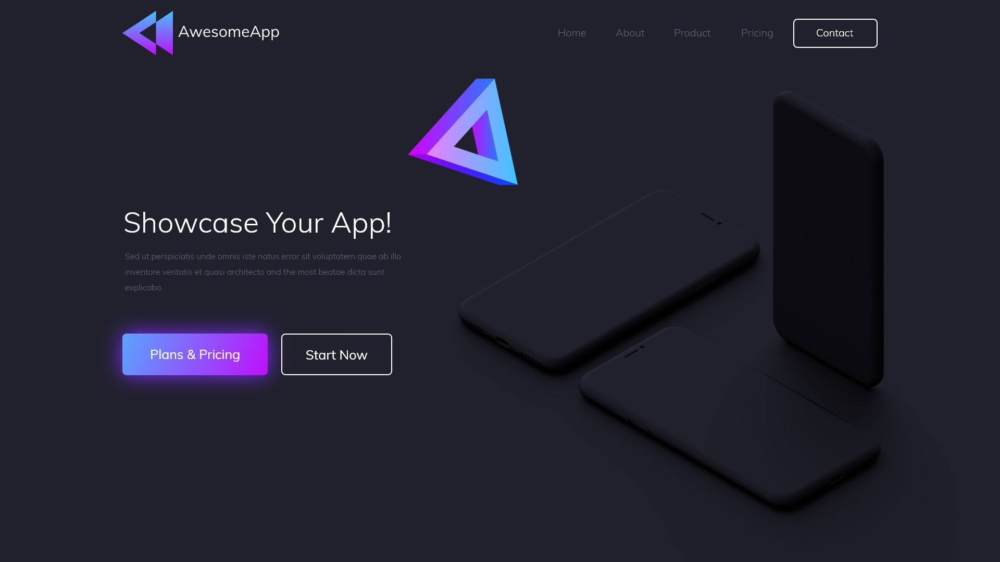
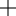
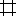
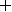

# Day 1 - Getting Started

Bismillah.

Tujuan utama dari High Selling Web Design Bootcamp adalah untuk membentuk sinergi yang kuat antara Web Designer dan Web Developer.

Kunci sinergi antara Web Designer dan Web Developer adalah kesesuaian antara spesifikasi desain dan implementasinya pada sebuah halaman website.

Di pertemuan pertama ini, kita akan memulai dengan bagaimana proses desain sebuah website agar dapat memahami dengan baik spesifikasi desainnya.

## A. Apa saja yang perlu dipersiapkan?

Tool desain yang akan kita gunakan adalah Figma.

Kenapa Figma?

- Bisa digunakan oleh semua dekstop platform karena aplikasinya berbasis web
- Bisa kolaborasi dengan 2 orang atau lebih
- Lebih ringan dan stabil dibandingkan dengan software native seperti Adobe XD atau Sketch

Download aplikasinya disini:

?>
	- Mac: https://www.figma.com/download/desktop/mac/  
	- Windows: https://www.figma.com/download/desktop/win/  
	- Linux: https://www.figma.com/ (Web Version)

## B. Mengenal istilah di Figma

Sebelum men-desain, ada beberapa istilah yang perlu kita ketahui:

- **Frame**  
Adalah *canvas* yang digunakan untuk semua komponen desain. Ukurannya biasanya sesuai screen device yang akan didesain, misalnya untuk mobile atau desktop.  

- **Layout Grid**  
Untuk memudahkan desain, kita menggunakan grid sistem. Yaitu membagi *Frame* dengan beberapa kolom. Fungsi kolom adalah menjadi acuan besarnya elemen desain yang akan kita buat. Umumnya desain web menggunakan 12 kolom, dengan lebar kolomnya (*Width*) 70px, dan jarak antar kolomnya (disebut dengan *Gutter*) 30px.

- **Layers**  
Semua elemen desain yang kita buat akan ditampilkan dalam bentuk layer.

## C. Shortcut yang sering digunakan

- Zoom in/out dengan tekan `Ctrl + Mouse scroll` depan belakang
- Geser editor dengan tekan `Space + Klik kiri` drag ke arah yang diinginkan
- Group selection `Ctrl + G`
- Ungroup selection `Ctrl + Shift + G`
- Lock/unlock element `Ctrl + Shift + L`
- Hide semua UI editor dengan tekan `Ctrl + \`
- Memindahkan elemen desain setiap 10 pixel `Shift + Arrow`
- Duplicate desain dengan `Ctrl + D`
- Duplicate dengan drag `Alt + Klik kiri` drag ke arah yang diinginkan. Tekan `Shift + Alt + Klik kiri` agar perpindahannya lurus.
-  Align to left `Alt + A`
-  Align horizontal center `Alt + H`
-  Align to right `Alt + D`
-  Align to top `Alt + W`
-  Align vertical center `Alt + V`
-  Align to bottom `Alt + S`

## D. Desain landing page

Kita akan memulai dengan men-desain bagian pertama sebuah landing page berikut ini:

Buka Figma, dibawah ini akan disebutkan langkah-langkah cara membuatnya.

### 1). Persiapan

#### Frame dan Layout Grid

1. Klik , yang ada disebelah pojok kanan atas.  
Figma akan membuka file baru dengan nama *Untitled*.

	

2. Beri nama file dengan mengubah *Untitled*, misalnya menjadi "Awesome App".  
Klik *Untitled* yang ada dibagian tengah di toolbar atas menjadi *Awesome App* kemudian tekan Enter.

	

3. Buat *Frame*. Caranya klik  yang ada dibagian atas sebelah kiri atau dengan menekan `F` pada keyboard.  
Kemudian arahkan kursor ke area kosong dan klik kiri 1x sampai keluar frame kosong dengan ukuran 100 x 100 px.

	

4. Pada panel sebelah kanan, ubah ukuran frame menjadi 1920 x 1080 px (Width x Height).

	

5. Mengatur *Layout Grid*.  
Untuk mengaturnya, scroll kebawah pada panel sebelah kanan, selanjutnya:
	- Klik  pada menu *Layout Grid*, untuk membuat grid baru.  

	

	- Ubah bentuk *Grid* menjadi *Columns*, dengan Klik  dan ubah *Grid* menjadi *Columns*.

	

	- Selanjutnya, ubah optionnya menjadi seperti ini:   
		*Count* = **12**  
		*Type* = **Center**  
		*Width* = **70**
		*Gutter* = **30**

	

#### Download bahan desain

!> Download semua bahan desainnya disini:  
https://drive.google.com/open?id=1DXDULcAueUk4zj8Z6rUvJAkSVKd3RW0f.

Apa saja yang tersedia di bahan desain?

?>
	- Logo Awesome App  
	- Mascot  
	- Colors  
	- Gambar phone mockup  
	- Gambar preview landing page

#### Import bahan desain

1. Import semua bahan desain dengan drag ke Editor Figma.

	

	Keluarkan semua bahan desain dari *Frame* dan rapikan secukupnya agar memudahkan proses men-desain.

	

2. Ubah warna *Frame* utama dengan mengambil warna dari gambar Landing page.  
	
	

	Ikuti langkah-langkah berikut:
	- Klik pada *Frame* terlebih dahulu,  
	- Kemudian scroll kebawah pada panel sebelah kanan, sampai terlihat opsi *Fill*  
	- Klik pada kotak warna, ambil warna background dari gambar preview landing page dengan klik icon   
	- Selanjutnya klik pada gambar preview
	- Sekarang warna *Frame* sesuai dengan gambar preview.

### 2). Menyesuaikan logo

1. Ubah warna text AwesomeApp menjadi putih pada logo.
	
	

2. Pindahkan logo ke *Frame* utama. Tempatkan pada grid kolom paling kiri, sampai garis merah tanda sejajar dengan kolom muncul.

	

3. Sambil tekan `Shift` pada keyboard, klik dan tahan pada bagian pojok kanan bawah logo, kemudian sesuaikan lebar logo dengan 3 kolom.  
Lepas klik sampai garis merah muncul di batas kanan pada kolom ke 3.

	

4. Buat logo align to top dengan *Frame*, dengan klik pada logo kemudian tekan `Alt + W` pada keyboard.
	
	

5. Tambahkan jarak 40 px dari top *Frame*, dengan klik pada logo lagi, kemudian tekan `Shift + Arrow Down` 4 kali (ingat, 1 kali = 10 px).

	

### 3). Membuat menu navigasi

Untuk membuat menu, kita akan menuliskannya secara manual dengan menggunakan menu Text.

1. Klik  di toolbar bagian atas sebelah kiri atau tekan `T` pada keyboard.

	

2. Buat text menu sesuai gambar preview landing page.  
	- Atur ukuran font nya menjadi 20 px  
	
	

	- Ubah warnanya menjadi putih atau #fff  

	

	- Sesuaikan urutan dan jarak antar menu

	

### 4). Membuat button menu

Untuk membuat button dengan size yang dinamis, kita akan membuatnya menggunakan *Frame*.
	
1. Tekan `F` untuk membuat frame, sesuaikan ukurannya menjadi 160 x 50 px.

	

2. Hilangkan button background dengan hide *Fill*, kemudian tambahkan *Stroke* dengan ukuran 2 px berwarna #fff (putih). Kemudian ubah *Corner Radius* menjadi 7 px. 

	

3. Duplicate text menu dan masukkan text nya kedalam button.

	

> Karena button ini akan dipakai kembali, kita perlu mengubah namanya menjadi button.  
Klik pada *Frame* button, selanjutnya pada panel Layers, ubah namanya menjadi **button**.

### 5). Memposisikan menu navigasi

Sebelum kita pindahkan, kita perlu *Group* navigasinya agar pemindahannya lebih mudah.

> Agar gambar preview tidak ikut terseleksi, lock layernya dengan menekan `Ctrl + Shift + L` pada keyboard.

Setelah layer gambar locked, kita bisa leluasa menseleksi semua elemen navigasi kemudian tekan `Ctrl + G` untuk men-group-nya.

Kemudian drag group navigasinya ke samping kanan logo yang sudah kita tempatkan sebelumnya.

### 6). Membuat konten

Konten yang dimaksud adalah:

?>
	- Title  
	- Description  
	- Button

#### a. Membuat title
Tekan tombol `T` pada keyboard untuk mengaktifkan *Text*. Selanjutnya sesuaikan title dengan gambar preview:

- Font-size = **56**
- Font-weight = **Bold**
- Alignment = **Left**
- Fill = **#FFFFFF** (Putih)

#### b. Membuat description
Drag duplicate pada title yang sudah dibuat, sesuaikan text properties-nya seperti ini:

- Font-size = **20**
- Line-height = **32**
- Font-weight = **Regular**
- Alignment = **Left**
- Fill = **#FFFFFF** (Putih)
- Opacity = **80%**
- Sesuaikan lebar teks dengan lebar title

#### c. Copy button dari menu navigasi

- Double click pada menu navigasi sampai frame button terseleksi, kemudian tekan `Ctrl + C` untuk men-copy.
- Click diluar area menu navigasi, pastikan menu navigasi tidak dalam kondisi terseleksi. Tekan `Ctrl + V` untuk mem-paste.  
Kenapa harus seperti ini? Agar button tidak di paste didalam group menu navigasi.
- Pindahkan button hasil copy, dan posisikan dibawah konten description.

#### d. Styling button

Sesuaikan button text dengan gambar preview. Gunakan teknik duplicate drag untuk membuat 2 buttons.

##### d1. Membuat background linear gradient

- Ubah fill dari *Solid* menjadi *Linear*
- Sesuaikan 2 warna seperti yang di gambar preview
- Atur angle dengan menggeser **2 ujung node** ke bawah kanan dan ke atas kiri
- Hide stroke
	

##### d2. Styling button drop shadow

- Scroll down pada panel sebelah kanan, sampai pada bagian *Effects*
- Atur Drop Shadow dengan Blur = **30**, X = **0**, dan Y = **0**
- Ambil warna shadow dari tema warna di bahan desain

### 7). Memposisikan konten

- Group konten dengan menyeleksi semua elemen konten dan tekan `Ctrl + G`
- Sambil tekan `Shift`, klik logo AwesomeApp
- Align konten ke logo dengan tekan `Alt + A` (Align to left)
- Lepaskan seleksi antara logo dan konten dengan klik di luar area keduanya, sampai kotak seleksi hilang
- Klik kembali konten, atur menjadi vertical center dengan tekan `Alt + V` 

### 8). Memposisikan maskot

- Geser maskot ke dalam *Frame* utama, sesuaikan ukurannya agar tidak terlalu besar
- Seimbangkan jarak maskot antara menu navigasi dan konten

### 9). Memposisikan gambar utama

- Geser gambar ke dalam *Frame* utama
- Area gambar yang berada diluar area *Frame* akan ter masking secara otomatis
- Sesuaikan ukurannya secara proporsional dan juga seimbangkan jarak atas dan bawah

### 10). Hasil akhir

Gambar preview

Hasil export dari Figma

?> **Kenapa hasil akhir tidak sama dengan preview?**  
> Hasil akhir tidak sama dengan preview, karena kita menggunakan komposisi layout grid dengan lebar 1170 px.
InsyaAllah akan kita pelajari alasannya pada pertemuan mendatang.

!> Jika ada yang perlu ditanyakan silahkan ditanyakan di grup WhatsApp. Terima kasih