# Day 3 - Mobile Responsive

Perkembangan perangkat mobile yang sangat pesat di seluruh bagian dunia pastinya mempengaruhi desain sebuah website. Statistik dibawah ini membuktikan kalau saat ini di seluruh dunia, orang lebih banyak membuka website melalui mobile ketimbang desktop (komputer atau laptop).

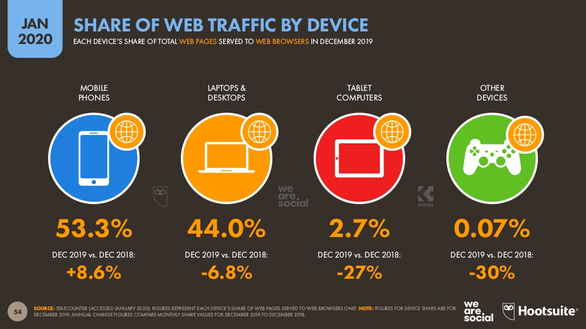
*53.3% Mobile vs 44.00% Desktop*

Meskipun pengguna mobile lebih banyak (53%), namun pengguna desktop tidak bisa dikatakan sedikit (masih 44%). Artinya, website saat ini sangat dituntut untuk fleksibel terhadap device yang digunakan, agar tetap nyaman dibuka baik di mobile maupun di desktop.

Solusinya adalah membuat desain website yang memiliki layout fleksibel terhadap *screen width* dari device yang digunakan. Dalam istilah *web development*, kita menggunakan tehnik css responsive untuk membuat layout website yang fleksibel.

## A. Konsep
### 1). Responsive Method
Untuk membuat website menjadi responsive, setidaknya ada 3 cara:

a. Membuat halaman khusus untuk desktop dan mobile  
b. Visible on desktop, hide on mobile  
c. Fully responsive  
d. Mobile only

#### a. Membuat halaman khusus untuk desktop dan mobile
Metode ini pada dasarnya membuat 2 website yang ditujukan untuk desktop dan mobile. Biasanya menggunakan domain yang berbeda, misalnya domain utama untuk website versi desktop, dan subdomain mobile untuk versi mobile. Biasanya ini digunakan oleh website yang memiliki kompleksitas yang tinggi dari segi konten dan sistemnya, seperti:

- Sistem informasi
- Aplikasi jasa atau layananan tertentu
- Media sosial
- Berita nasional

Contoh:
- https://republika.co.id/ (Versi Desktop)
- https://m.republika.co.id/ (Versi mobile)

> Tekniknya sistem website membaca screen width yang digunakan oleh pengguna, kemudian mengalihkan (redirect) alamat website dari desktop ke mobile. Teknik ini tidak menggunakan style css responsive, karena websitenya sudah spesifik (Desktop dan mobile punya style css masing-masing). 

#### b. Visible on desktop, hide on mobile
Cara ini masih menggunakan satu domain yang sama, tetapi memiliki elemen atau komponen yang ditujukan untuk desktop dan mobile. Sederhananya, kita membuat 2 elemen yang sama, yang ditujukan untuk desktop dan mobile.

Biasanya cara ini digunakan untuk memaksimalkan ads atau komponen tertentu yang terlalu kompleks untuk dibuat css responsive nya. Misalnya:

- Gambar banner untuk iklan atau promosi
- Header menu  
- Footer menu

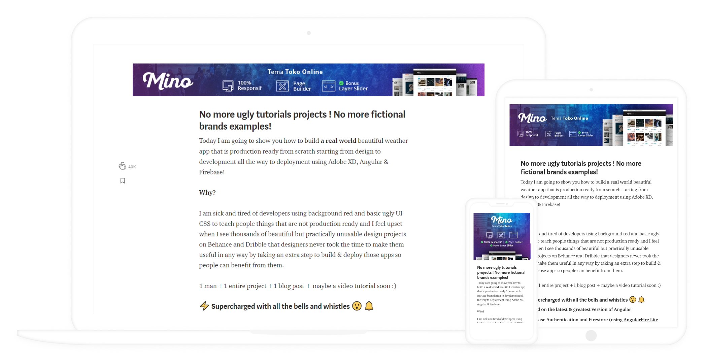

<em>Desktop - landscape = Tablet - higher = Mobile square </em>

Contohnya, banner yang landscape tampil di desktop, ketika dibuka dari mobile gambar banner akan diganti menggunakan ukuran kotak. Karena kalau tetap dengan banner yang landscape akan menjadi terlalu kecil kalau dibuka di mobile.

> Tekniknya buat 2 banner atau elemen dalam satu website untuk konten yang sama untuk desktop dan mobile. Hide elemen versi mobile saat di desktop dan hide versi dekstop saat di mobile.

#### c. Fully responsive
Cara ini memaksimalkan style css untuk membuat layout dan elemen fleksibel terhadap *screen width*. Ada 2 teknik untuk membuatnya:

1) Progressive Advancement (Mobile first)  
2) Graceful Degradation (Desktop first)

1) Progressive Advancement (Mobile first)  
Artinya, kita memulai desain dari screen mobile, dengan memulai dari komponen dan elemen yang utama. Kemudian kita kembangkan untuk screen yang lebih besar atau tablet, selanjutnya kita kembangkan lagi untuk screen desktop.

2) Graceful Degradation (Desktop first)
Teknik ini memulai dari desain untuk screen desktop, dengan komponen dan elemen yang lengkap, kemudian kita sesuaikan komponen dan elemennya dengan screen yang lebih kecil sampai screen mobile yang paling kecil. Pada prosesnya bisa jadi ada komponen atau elemen yang kita sederhanakan atau kita hilangkan agar sesuai dengan screen yang lebih kecil.

Memulai desain (juga development) dari mobile terlebih dahulu (Mobile first) akan lebih efektif dan efisien ketimbang memulai desain dari desktop (Desktop first). Alasannya, karena seperti statistik yang sudah kita ketahui diawal, pengguna mobile terus menerus bertambah dari tahun ke tahun, yang akhirnya pengguna mobile akan lebih banyak ketimbang pengguna desktop. Sehingga kita tidak memulai effort berlebihan diawal untuk desain versi desktop.

Contoh:
- https://klientboost.com/
- https://slack.com/intl/en-id/
- http://smashingmagazine.com/

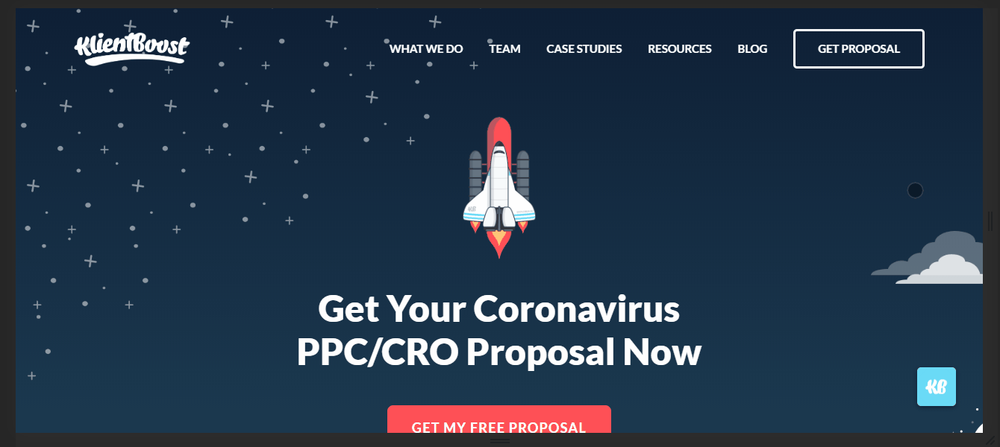

#### d. Mobile only
Sesuai dengan namanya, kita hanya perlu membuat versi mobile yang tetap akan ditampilkan dalam versi mobile sekalipun di screen desktop. 
Jika sebuah produk memiliki pasar yang ditujukan untuk masyarakat umum, seperti fashion, aksesoris dan lainnya, maka cara ini bisa digunakan. Karena tentunya masyarakat umum akan lebih berpotensi memiliki smartphone ketimbang laptop atau komputer.

Contoh:
- https://www.sorabel.com/ (Hati-hati aurat)

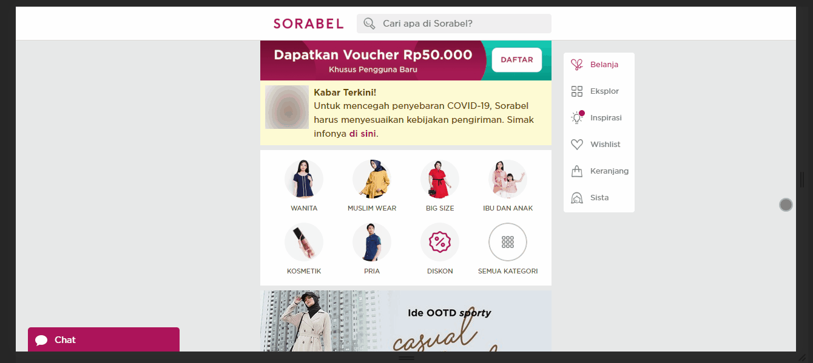

### 2). Media Query & Breakpoints
Media Query memungkinkan kita untuk membuat style khusus untuk kondisi khusus. Dalam hal ini berkaitan dengan screen. Sementara breakpoints adalah istilah yang digunakan untuk batas-batas screen desktop, tablet dan mobile pada style css.

> Secara detail akan kita pelajari pada materi html dan css responsive.

## B. Penyesuaian Layout & Elemen
Ketika kita mendesain atau men-develop website yang responsive, ada beberapa poin yang umumnya perlu kita sesuaikan, diantaranya adalah:
1. Column  
2. Spacing
3. Font-size
4. Image-size

### 1). Column
Di awal kita sudah mempelajari tentang Grid System, yang umumnya memiliki `12` kolom, dengan jarak antar kolomnya `30px`. Perubahan column yang dimaksud adalah perubahan dari `12` kolom menjadi `4` kolom, `2` kolom atau `1` kolom yang di sesuaikan dengan screen-width nya.

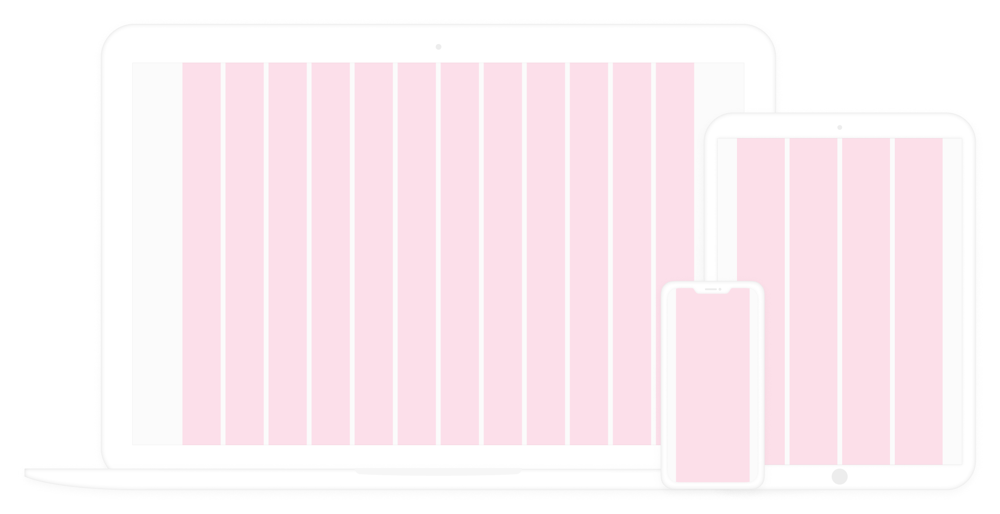

<em>Desktop 12 columns = Tablet 4 columns = Mobile 1 column </em>

### 2). Spacing
Perubahan yang cukup signifikan biasanya pada vertical spacing, namun tetap disesuaikan dengan sistematis, untuk menjaga konsistensi desain, maka tetap dengan kelipatan `4px` atau `8px`.

Misalnya:
- Desktop = `160px`  
- Tablet = `72px`  
- Mobile = `32px`

*Dari 160px menjadi 72px, kemudian 32px.*

### 3). Font-size
Seperti halnya pada spacing, perubahan font-size dari mobile ke desktop atau sebaliknya, tetap sistematis, dengan kelipatan `4px` atau `8px`. Umumnya perubahannya pada judul halaman atau heading dibawahnya.

Misalnya:
- Desktop = `56px`  
- Tablet = `32px`  
- Mobile = `24px`

*Dari 56px menjadi 32px, kemudian 24px.*

### 4). Image-size
Untuk menjaga rasio gambar, penyesuaian pada image-size akan lebih mudah, karena kita tinggal image-size dengan `100%`, dan image-height nya dengan `auto`. Artinya lebar gambar akan selalu mengikuti screen-width, sementara tingginya akan proporsional menyesuaikan lebar gambar.

## C. Perubahan Bentuk & Posisi
Selain penyesuaian layout dan column, termasuk didalamnya spacing dan font-size, juga image-size, desain responsif juga memungkinkan kita untuk merubah bentuk dan posisi sebuah komponen atau elemen desain.

Perubahan bentuk dan posisi yang sering terjadi ada pada 3 hal berikut:

- Navigation bar
- Reverse column
- Hide unused component/elemnt

### 1). Navigation bar
Navigation bar atau page menu pada website yang umumnya berjejer secara horizontal, dari kiri ke kanan, akan berubah menjadi list bertumpuk secara vertikal. Sedangkan posisinya biasanya berkisar pada 3 posisi berikut:
- Collapsed menu (Top to bottom)
- Slide (Left to right)
- Zoom or fade

<em>Contoh collapsed menu (Top to bottom) </em>

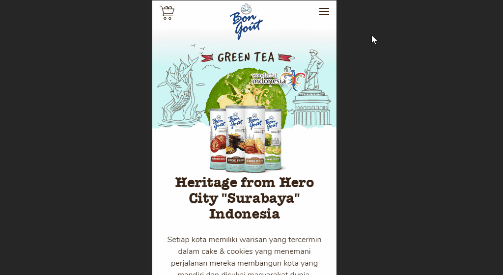

<em>Contoh zoom atau fade </em>

### 2). Column Reverse
Secara default, perubahan layout dari horizontal menjadi vertikal tidak akan merubah susunan elemen atau objek. Sedangkan dalam layout desain, khususnya untuk desktop, terkadang perlu desain yang tidak berurutan A-B, C-D, tetapi bisa jadi akan A-B, D-C. Maka ketika layout berubah menjadi vertikal pada mobile, urutan elemen tidak berurutan A-B-C-D, tetapi A-B-D-C, maka kita perlu column-reverse supaya urutan elemennya menjadi benar yaitu A-B-C-D.

Dibawah ini adalah contoh dari penjelasan diatas:
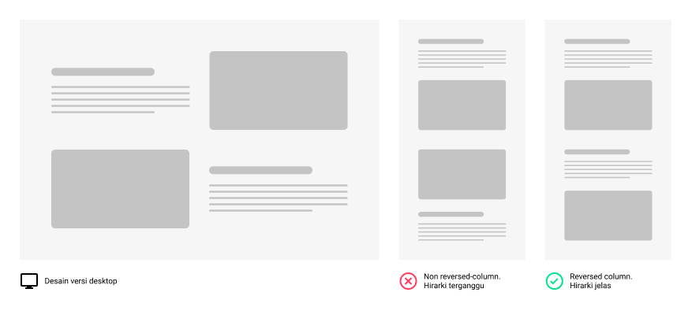

### 3). Hide unused component/element
Tidak semua elemen desain harus ditampilkan di semua versi desain. Biasanya versi mobile selalu lebih sederhana ketimbang versi desktop. Karena area mobile sangat terbatas, sehingga jika terlalu banyak elemen akan menyulitkan informasi konten website untuk dicerna.

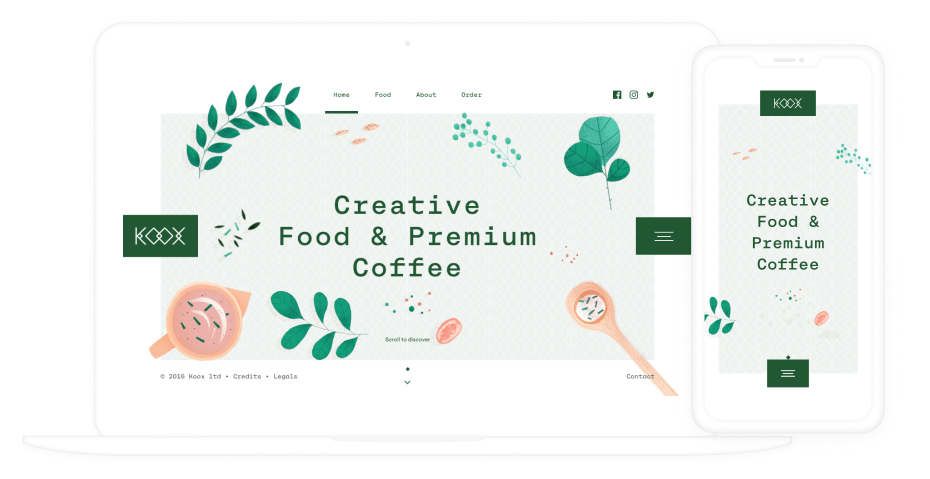

<em>Desktop vs Mobile </em>

## D. Responsive Design Tips
Dibawah ini akan dijelaskan secara singkat bagaimana mendesain website responsive yang efektif dan efisien menggunakan Figma.

### 1). Memulai desain dari mobile
Tentunya, memulai desain dari mobile ini untuk project yang memang akan fully responsive, dan memang audience nya akan lebih banyak pada pengguna mobile. Jika audience utamanya pada desktop, tentunya lebih efektif memulai desain dari desktop.

#### Tentukan frame mobile, dengan ukuran iPhone 11/X
Kenapa ukuran iPhone bukan android? Karena kita sedang mendesain website, bukan aplikasi, maka kita hanya perlu frame mobile secara umum, karena kita tidak terpaku pada aturan UI seperti halnya aplikasi untuk platform khusus iOs atau Android.

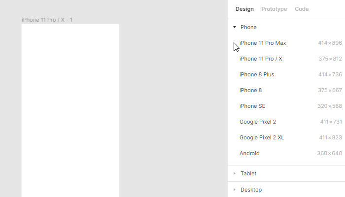

Artinya, untuk alasan estetika iPhone lebih menjual, juga di internet kita lebih mudah mendapatkan mockup iPhone ketimbang Android. Dan di Figma sendiri, kalau kita Play mode prototype, bisa ditampilkan frame iPhone, sehingga akan terlihat lebih real daripada hanya kotak.

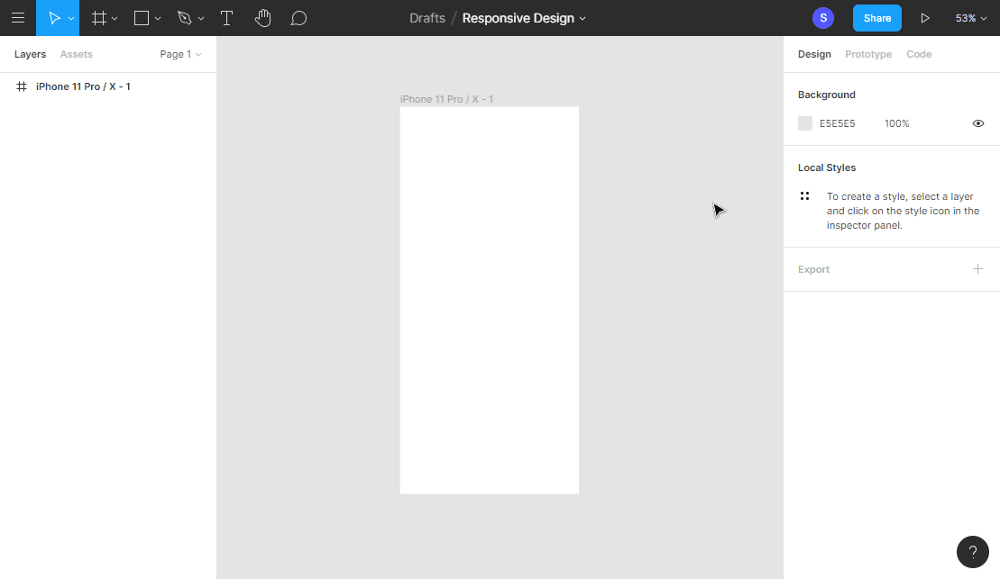

<!-- ### 2). Mengetahui above the fold
Layar sebuah device terutama tingginya tentunya terbatas, sementara desain yang akan kita buat bisa jadi akan melebihi tinggi layar sebuah device, yang artinya user perlu men-scroll kebawah untuk melihat informasi desain yang lebih lengkap. Artinya kita perlu mensiasati supaya informasi yang pertama kali dilihat oleh user pada device yang ia gunakan (Above the fold) dapat dipahami dengan baik dan jelas, tanpa friksi atau kebingungan. Kita juga dapat memberikan petunjuk tertentu supaya user tahu kalau ia bisa scroll kebawah untuk melihat informasi lainnya, atau kita berikan daya tarik tertentu supaya men-trigger user untuk scroll kebawah. Biasanya kita bisa menggunakan paling tidak 3 cara:

- Membuat tombol call to action untuk scroll kebawah (ke inti penawaran)  
- Membuat petunjuk scroll dengan animasi mouse scroll
- Membuat item atau komponen terpotong, sebagai tanda bahwa masih ada konten dibawahnya 

[Contoh 3 bentuk gambar above the fold] -->

### 3). Layouting dengan Auto layout
Auto layout dapat membantu kita menyusun layout dengan cepat dan mudah. Caranya dengan select semua element yang akan kita jadikan 1 layout, kemudian tekan `Ctrl + Alt + G` untuk Frame selection, kemudian klik `Auto Layout` di sidebar kanan. 

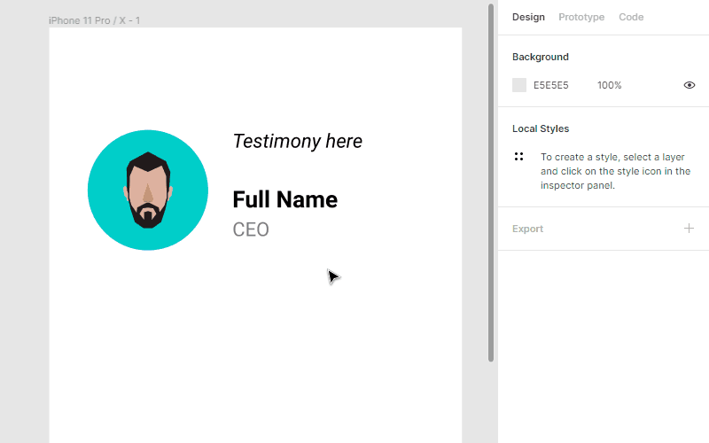

> **Frame Selection** berfungsi seperti group, bedanya menggabungkan element kedalam 1 frame, dengan ukuran frame-nya menyesuaikan lebar selected-element.

<!-- #### Trik membuat spacing khusus pada element tertentu
Saat ini Auto layout belum memungkinkan kita untuk membuat spacing yang berbeda dengan element dalam 1 auto-layout, karena kalau kita set spacing between item nya `16px`, maka spacing antar element akan sama semua, yaitu `16px`. Untuk mensiasati ini, kita dapat membuat autolayout khusus pada element yang akan kita tambahkan. Langkah seperti berikut:

1. Seleksi elemen yang akan dibuat jarak khusus  
2. CTRL + ALT + G untuk membungkus elemen dengan *frame*  
3. Buat autolayout pada frame yang sudah dibuat

 -->

### 4). Explorasi sendiri

Figma dan tools desain lainnya hanyalah alat. Ide dan kreatifitas tetap dari kita. Maka tools harus mengikuti kreatifitas kita, sehingga ketika kita akan membuat sesuatu yang belum kita tahu caranya kita akan mencari tahu sendiri dengan mengeksplor lebih dalam, mencari tahu atau menanyakan kepada yang pernah menggunakannya.

