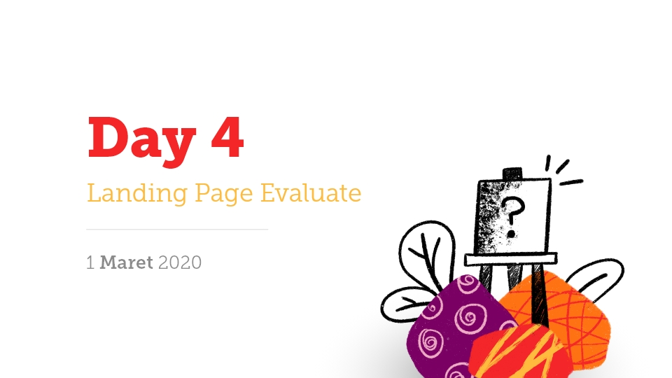

# Day 4 - Landing page evaluate

Evaluasi landing page yang dimaksud lebih kepada subjek yang menilai sebuah desain landing page yang kita buat. Seperti halnya quote tentang skripsi: **"Skripsi yang baik adalah yang selesai"**, maka **"Desain yang baik adalah desain yang dipakai"**. Desain website yang diapakai akan selalu lebih baik ketimbang desain yang hanya menjadi pajangan (Mockup forever / Prototype forever). Tapi adakalanya kita membuat desain pajangan untuk menarik client atau konsumen. Terlebih lagi desain website akan selalu diupdate secara berkala mengikuti perkembangan produk dan teknologi.

Ketika kita berlatih desain maka kita hanya perlu **Just Do It**. Jangan terjebak dengan perfeksionis. Semakin banyak kita mendesain, maka semakin bagus kualitas yang akan kita buat. Ada banyak hal yang akan kita dapatkan ketika kita banyak mencoba:

- Lebih banyak penasaran  
- Lebih banyak belajar
- Menemukan cara yang lebih cepat
- Memiliki banyak karya

Barakallahu fiikum.